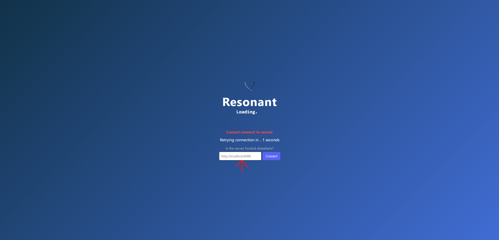
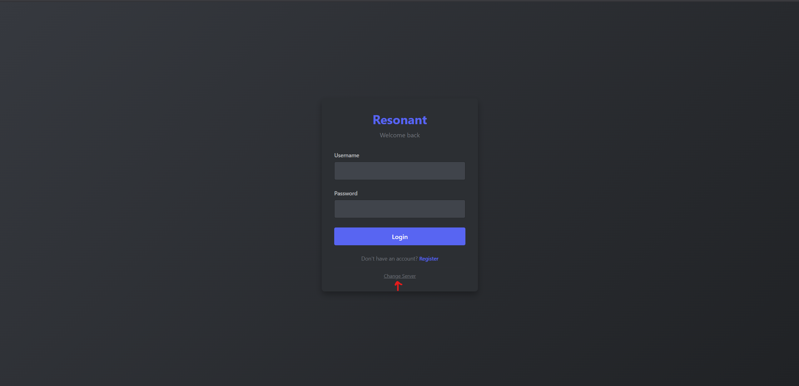
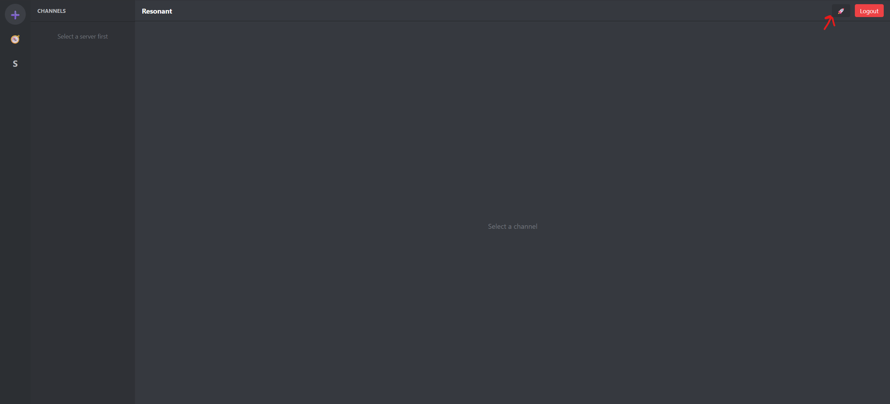

# Resonant - Online messaging app

A modern, privacy focused Discord-like chat platform built with Quarkus and React.

Try it out [here](https://mr-357.github.io/Resonant/)

## Architecture

- **Backend**: Quarkus 3.x
- **Frontend**: React 18 + Vite, PWA-enabled
- **Database**: PostgreSQL (relational) OR SQLite (file-based)

## Features (MVP)

- User authentication (username/password with JWT)
- Create and manage servers
- Create channels within servers
- Real-time WebSocket messaging
- Server Discovery and Join/Leave
- Server instance change
- PWA support (offline caching, desktop install)

## Project Structure

`backend` -- Contains all the backend related files: the Quarkus project, Dockerfile for running it and database migrations

`frontend` -- Contains the frontend components, vite config, Playwright tests and Dockerfiles for both the frontend and running e2e tests

`k8s` -- Example Kubernetes manifests

In the root of the project is a docker-compose file for running the app.


## Deployment

There are multiple ways of running the application depending on your technical ability, installed dependencies or system requirements.


### "Standalone mode" - easiest for beginners

This mode uses the SQLite database for easiest deployment and no installation of additional dependencies. It's only recommended for demos or a small number of users. Proceed with caution. It's recommended to replace the certificates with your own, or use Let's Encrypt! 


1. Download the assets for running the backend from the [releases](https://github.com/Mr-357/Resonant/releases) page.
2. Modify the application.yaml file based on your needs. Check the [Wiki](https://github.com/Mr-357/Resonant/wiki/Configuration) for more information. It's highly recommended to update certain properties.
3. Run the native executable from your terminal of choice:

  - Linux: `./resonant-backend-1-runner -Dquarkus.profile=sqlite`
  - Windows: `.\resonant-backend-1-runner.exe -Dquarkus.profile=sqlite`

4. Use the frontend from [Github Pages](https://mr-357.github.io/Resonant/) to connect to your local backend by changing the instance:

- In case the demo server is down:



- In case you are not logged in:



- In case you are logged in:



You can also download the PWA version to have it available locally and change instances as you please. Other people can connect to your backend through a VPN such as Radmin or by exposing the backend ports to the internet. You will get an SSL error when using self-signed certificates, so you and anyone else who wants to connect must import the certificate located in `certs/server.crt` into the browser or system trust store.

#### Do not import the certificates provided with the download into your browser, generate your own by running the script for generating self-signed certificates. The provided certificates are exclusively for testing purposes. Only import certificates you trust!

 On Google Chrome, this can be done by going to Settings>Advanced>Privacy and Security>Manage Certificates. In that page you can import the file, restart Chrome and the error should no longer appear.


### Local Docker Compose

This mode also enables easy deployment and all of the services locally, but has similar drawbacks of not being easily accessed over the internet. Requires docker and docker compose installed.

1. Clone the project locally
2. Run `docker-compose up -d`
3. Try connecting to `https://localhost:3443`
  

### On-prem Deployment

Check the [Wiki](https://github.com/Mr-357/Resonant/wiki/On%E2%80%90prem-deployment)


### Kubernetes (Minikube)

Build and push images:
```bash
docker build -t myregistry/resonant-backend:1.0 ./backend
docker build -t myregistry/resonant-frontend:1.0 ./frontend
docker push myregistry/resonant-backend:1.0
docker push myregistry/resonant-frontend:1.0
```
... or use the ones from the github container registry. Make sure to update the certificates if using pre-built images.

Update `k8s/*.yaml` with image URLs and deploy.

```bash
kubectl apply -f k8s/configmap.yaml
kubectl apply -f k8s/backend-deployment.yaml
kubectl apply -f k8s/frontend-deployment.yaml
kubectl apply -f k8s/service.yaml

# Port-forward to access
kubectl port-forward svc/resonant-frontend 3443:3443
kubectl port-forward svc/resonant-backend 8443:8443
```
## Development

### Local Development with Docker Compose

```bash
# Build and start all services
docker-compose up --build

# Services available at:
# Frontend: https://localhost:3443
# Backend: http://localhost:8443
# PostgreSQL: localhost:5432
# Redis: localhost:6379
```

### Manual Development Setup

**Backend:**
```bash
cd backend
mvn quarkus:dev
# Backend runs on https://localhost:8443
# Auto-reload enabled on code changes
```

**Frontend (separate terminal):**
```bash
cd frontend
npm install
npm run dev
# Frontend runs on http://localhost:3000
```

### Running playwright tests

If you don't want to set up the database and services for playwright tests, there is a docker-compose file in the `frontend/e2e` folder which will set everything up for testing. You can run the tests with `docker-compose run --build  --rm e2e-tests`.

## API Documentation

### OpenAPI/Swagger Documentation

Once the application is running, you can access the interactive API documentation at:

- **Swagger UI**: `https://localhost:8443/q/swagger-ui`
- **OpenAPI JSON**: `https://localhost:8443/q/openapi`
- **OpenAPI YAML**: `https://localhost:8443/q/openapi?format=yaml`

## Troubleshooting


See [Wiki](https://github.com/Mr-357/Resonant/wiki/Troubleshooting)

## Roadmap

See [Wiki](https://github.com/Mr-357/Resonant/wiki/Roadmap).


## Contributing

### Issues

If you encounter an issue or a bug while using the app, please create a Github issue with the details of what you're experiencing. A template will be provided when you create a new issue, so follow the instructions provided.

### Making Changes

1. Create a fork of the project
2. Create a branch: `git checkout -b feature/my-feature`
3. Make changes
4. Write tests for your feature and make sure they are passing. Playwright tests are really helpful for any big features
5. Commit: `git commit -m "feat: description"` (use conventional commits if possible)
6. Push: `git push origin feature/my-feature`
7. Create PR for code review

## License

Apache 2.0 - See [LICENSE](LICENSE)
